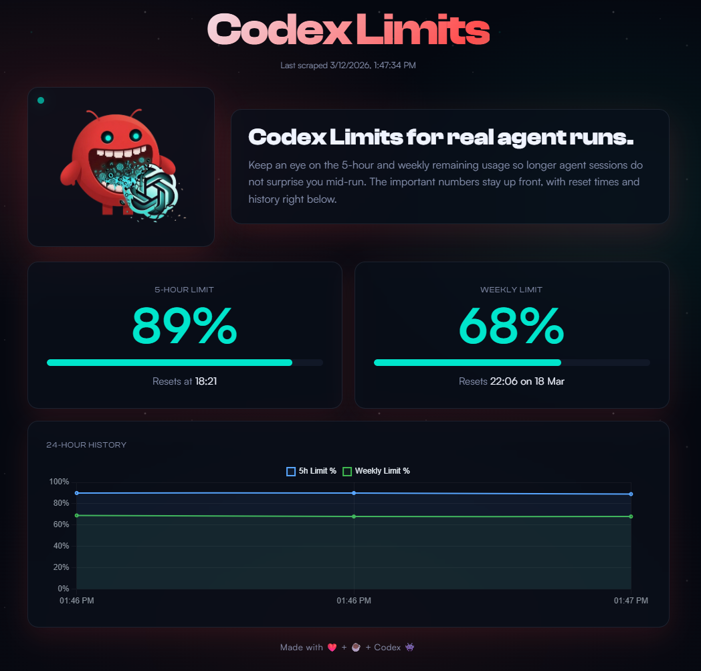
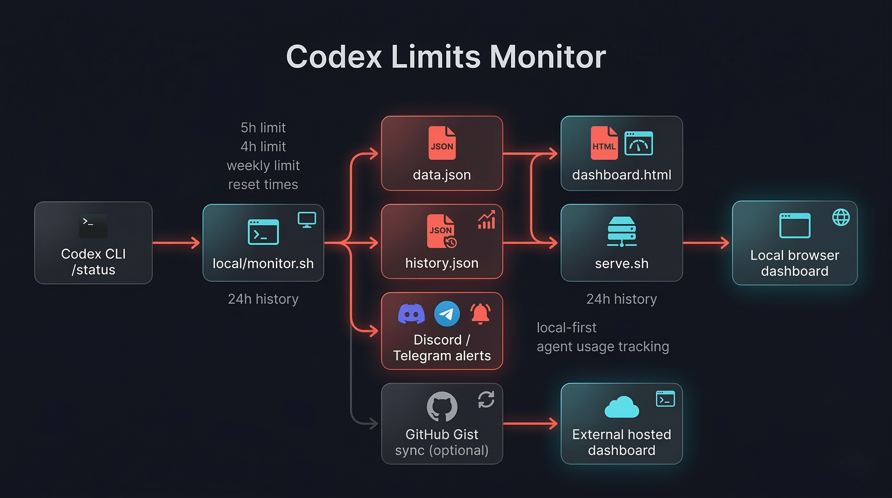
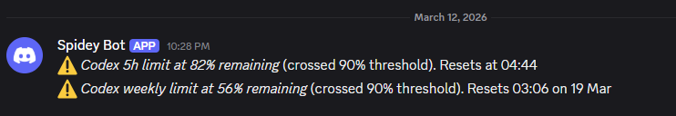

# Codex Usage Monitor

Track your OpenAI Codex CLI usage limits in real time locally, with optional external access. No cloud accounts required to get started.

**Problem:** OpenAI already exposes Codex usage through its local app-server and in the ChatGPT Codex usage page, but those views do not give you rolling history or proactive notifications when you're running low.

**Solution:** A local bash script that reads the Codex app-server on exact 15-minute boundaries, writes a `data.json` snapshot, serves a dashboard in your browser, and fires Discord or Telegram alerts directly all from your own machine, with zero cloud dependency.



---

## Table of Contents

1. [Architecture Overview](#architecture-overview)
2. [Project Structure](#project-structure)
3. [Prerequisites](#prerequisites)
4. [Quick Start (Local)](#quick-start-local)
5. [Ways To Run It](#ways-to-run-it)
   - [Option A: Two Local Terminals](#option-a-two-local-terminals-easiest)
   - [Option B: Bash Background Process](#option-b-bash-background-process)
   - [Option C: tmux](#option-c-tmux-recommended)
   - [Option D: WSL (Windows)](#option-d-wsl-windows)
   - [Option E: LXC Container](#option-e-lxc-container)
   - [Option F: systemd service](#option-f-systemd-service-linux)
   - [Option G: cron](#option-g-cron)
6. [Advanced Analytics](#advanced-analytics)
7. [Notifications (Discord & Telegram)](#notifications-discord--telegram)
8. [External Dashboard (Optional)](#external-dashboard-optional-github-gist--pages)
9. [Configuration Reference](#configuration-reference)
10. [Troubleshooting](#troubleshooting)
11. [Contributing](#contributing)
12. [License](#license)

---

## Architecture Overview



```
┌──────────────────────────────────────┐
│  Your machine (any OS with bash)      │
│                                        │
│  Codex limits + local agent sessions   │
│       ↓                                │
│  local/monitor.sh                      │
│       ↓              ↓                 │
│  JSON + SQLite     Discord/Telegram    │
│       ↓              (direct curl)     │
│  dashboard.html + analytics.html       │
│  (browser via serve.sh)                │
└──────────────────────────────────────┘
          │ optional (Tier 2)
          ▼
   GitHub Gist ──→ yourname.github.io/codex-monitor
   (JSON blob)       (static dashboard)
```

**Tier 1 — Local only:** Everything runs on your machine. No external accounts beyond your existing OpenAI / ChatGPT subscription.  
**Tier 2 — External dashboard (optional):** `monitor.sh` also PATCHes a GitHub Gist. A static GitHub Pages site reads from it. Requires a GitHub account and a Personal Access Token.

---

## Project Structure

```text
codex-usage-monitor/
|-- local/
|   |-- monitor.sh        # Codex usage collector, alerts, optional Gist sync
|   |-- config.py         # Safe shared .env parsing and typed validation
|   |-- history.py        # Temporal history validation, retention and recovery
|   |-- dashboard.html    # Local dashboard UI
|   |-- analytics.html    # Local long-term limits/token analytics UI
|   |-- analytics.py      # Read-only aggregation used by /api/analytics
|   |-- codex_status.py   # Codex app-server status protocol
|   |-- token_usage.py    # Codex/OpenCode/Hermes token collectors
|   |-- storage.py        # Shared SQLite schema and integrity checks
|   |-- pricing.json      # Versioned API-equivalent pricing catalog
|   |-- assets/preferences.js # Shared language/currency preferences
|   |-- serve.sh          # Allowlisted HTTP server for LAN access
|   |-- .env.example      # Config template; copy to .env
|   |-- .env              # Your local config (git-ignored, created by you)
|   |-- runtime/          # Private generated state (git-ignored, mode 0700)
|   |   |-- data.json     # Usage snapshot without account identity
|   |   |-- history.json  # Rolling usage history
|   |   `-- usage-history.sqlite3  # Progressive long-term archive
|   `-- images/
|       |-- hero.png
|       |-- framework.png
|       |-- discord.png
|       |-- logo.png
|-- .gitignore
|-- .github/workflows/ci.yml # Pinned CI, coverage, audit and browser checks
|-- tests/                   # Shell, Python, Node and browser regression tests
|-- systemd/                 # Versioned monitor/dashboard service templates
|-- scripts/release.sh       # Archive and SHA-256 checksum builder
|-- VERSION                  # Current SemVer release
|-- CHANGELOG.md
|-- LICENSE
`-- README.md
```

---

## Prerequisites

### Required (Tier 1)
| Requirement | Check | Install / Setup |
|---|---|---|
| OpenAI Codex CLI | `codex --version` | `npm i -g @openai/codex` — [CLI docs](https://developers.openai.com/codex/cli/) |
| Codex CLI authenticated | Codex app-server returns usage data | Run Codex once and sign in (see note below) |
| bash | `bash --version` | Pre-installed on Linux/WSL |
| curl | `curl --version` | Pre-installed on most systems |
| python3 | `python3 --version` | [python.org](https://python.org) — needed for dashboard server & JSON handling |

> [!NOTE]
> **First-time Codex users — you must authenticate before using this tool.**
> 
> The monitor uses the local Codex app-server, which only works after you have signed in. If you have never run Codex before:
> 
> ```bash
> # 1. Install the CLI
> npm i -g @openai/codex
> 
> # 2. Launch Codex — it will prompt you to sign in on first run
> codex
> ```
> 
> Authenticate with your **ChatGPT account** (Plus, Pro, Business, Edu, or Enterprise) or an **API key**.
> Once signed in, verify with `codex /status` — you should see your usage percentages.
> 
> Full setup details: [developers.openai.com/codex/cli](https://developers.openai.com/codex/cli/)

> **Windows users:** Run everything inside WSL. Native Windows bash is not supported. See the [Windows setup guide](https://developers.openai.com/codex/windows).
>
> **Supported / tested:** Linux-based shells only. We have tested this on WSL and on a Proxmox LXC container.

### Optional (Tier 2 — External Dashboard)
| Requirement | Notes |
|---|---|
| GitHub account | Free — for Gist storage and Pages hosting |
| GitHub Personal Access Token | `gist` scope only. Create at [github.com/settings/tokens](https://github.com/settings/tokens) |

---

## Quick Start (Local)

```bash
# 0. Make sure Codex CLI is installed and authenticated
#    (skip if you already use Codex daily)
npm i -g @openai/codex   # install
codex                     # first run — sign in when prompted
codex /status             # verify — should show usage percentages

# 1. Clone
git clone https://github.com/AlexandreDor/ai-usage-monitor.git
cd ai-usage-monitor/local

# 2. Configure
cp .env.example .env
# Edit .env — Discord/Telegram are optional, leave blank to skip.
# Do not source .env; monitor.sh and serve.sh parse it as configuration data.
chmod 600 .env

# 3. Make executable
chmod +x monitor.sh serve.sh

# 4. Run once to verify
./monitor.sh --check
./monitor.sh --once
# Output: parsed JSON printed to terminal, runtime/data.json written

# Other useful modes
./monitor.sh --help
./monitor.sh --status-json
./monitor.sh --loop 900

# 5. Open the dashboard
./serve.sh
# On this machine: http://localhost:8080/dashboard.html
# Advanced analytics: http://localhost:8080/analytics.html
# For trusted LAN access: ./serve.sh --bind 0.0.0.0 --port 8080
```

Important: `serve.sh` only hosts an explicit allowlist containing the two dashboards, their local assets, the favicon, `data.json`, `history.json`, and the read-only `/api/analytics` response. The raw SQLite archive and files such as `.env`, `.alert_state`, `health.json`, locks, logs, and directory listings are never served. It does not refresh usage by itself; `monitor.sh` must also run on a loop or schedule.

### LAN security

`serve.sh` listens on `127.0.0.1` by default. LAN access must be enabled explicitly with `./serve.sh --bind 0.0.0.0 --port 8080`. The server provides neither authentication nor TLS, so anyone able to reach that port can see usage percentages, reset times, local token counts, model names, and cost estimates.

- The generated JSON never contains the Codex account identity or tokens.
- `.env` is parsed as configuration data rather than executed as shell code.
- Runtime data and secrets are created with owner-only permissions.
- Use a host firewall to restrict port `8080` to your trusted local subnet.
- Do not forward port `8080` on the router or expose this server directly to the internet.
- Keep the default bind for same-machine access; use a trusted reverse proxy if authentication or TLS is required.

---

## Ways To Run It

Pick the simplest option that fits your environment. In every setup:

- `monitor.sh` reads Codex and writes `data.json` / `history.json`, while
  also maintaining the local SQLite archive
- `serve.sh` serves `dashboard.html`, `analytics.html`, and the local read-only analytics API

This project is designed for local Linux-style execution. Docker is intentionally not documented as a supported runtime because the current status capture depends on an authenticated local Codex CLI environment.

### Option A: Two Local Terminals (easiest)

Best for: first-time setup, testing, and most local users on Linux/WSL.

Terminal 1:
```bash
cd /path/to/codex-usage-monitor/local
./monitor.sh --loop 900
```

Loop mode reads immediately at startup, then aligns subsequent checks to the
configured wall-clock boundaries. With `900`, checks run at `:00`, `:15`,
`:30`, and `:45` instead of 15 minutes after the previous collection completes.

Terminal 2:
```bash
cd /path/to/codex-usage-monitor/local
./serve.sh
```

Then open:
```text
http://localhost:8080/dashboard.html
```

For faster testing:
```bash
./monitor.sh --loop 60
```

---

### Option B: Bash Background Process

Best for: one shell, lightweight local use, quick demos.

```bash
cd /path/to/codex-usage-monitor/local
./monitor.sh --loop 900 > /tmp/codex-monitor.log 2>&1 &
MONITOR_PID=$!
./serve.sh
```

Stop the background monitor later with:
```bash
kill "$MONITOR_PID"
```

---

### Option C: tmux (recommended)

Best for: any Linux/WSL machine where you want a simple persistent session.

```bash
# Install if needed
sudo apt install tmux        # Debian/Ubuntu

# Start monitor in a named session
tmux new -s codex-monitor 'cd /path/to/codex-usage-monitor/local && ./monitor.sh --loop 900'

# Detach (leave running): Ctrl+B, then D
# Reattach later:
tmux attach -t codex-monitor

# Start dashboard in a second session (optional)
tmux new -s codex-dash 'cd /path/to/codex-usage-monitor/local && ./serve.sh'
```

---

### Option D: WSL (Windows)

Best for: Windows users who want native Linux tooling without a full VM.

```powershell
# Install WSL2 (run in PowerShell as Administrator)
wsl --install

# Then in the WSL terminal:
cd /mnt/c/path/to/codex-usage-monitor/local
chmod +x monitor.sh serve.sh
./monitor.sh            # test once

# Run continuously with tmux inside WSL
tmux new -s codex-monitor './monitor.sh --loop 900'
```

> The dashboard served from WSL is accessible on Windows via `http://localhost:8080/dashboard.html` — WSL2 bridges the network automatically.

---

### Option E: LXC Container

Best for: Proxmox homelab users or anyone running LXC on Linux.

```bash
# Create a lightweight Alpine or Ubuntu container
# (example using Proxmox pct or plain lxc-create)

# Proxmox:
pct create 200 local:vztmpl/ubuntu-22.04-standard_22.04-1_amd64.tar.zst \
  --hostname codex-monitor --memory 256 --rootfs local-lvm:4

pct start 200
pct exec 200 -- bash

# Inside the container:
apt update && apt install -y bash curl python3 git grep
git clone https://github.com/AlexandreDor/ai-usage-monitor.git
cd ai-usage-monitor/local
cp .env.example .env && nano .env
chmod +x monitor.sh serve.sh

# Run monitor as systemd service (see Option F below)
# Bind port 8080 in your LXC config if you want external access:
# pct set 200 -net0 name=eth0,bridge=vmbr0,ip=dhcp
```

---

### Option F: systemd service (Linux)

Best for: servers, headless Linux boxes, Raspberry Pi — auto-starts on boot and restarts on failure.

```bash
# The versioned templates use %h/ai-usage-monitor. Keep this clone path,
# or adjust the two unit files before installing them.
cd "$HOME/ai-usage-monitor"
sudo install -m 644 systemd/codex-usage-monitor@.service /etc/systemd/system/
sudo install -m 644 systemd/codex-usage-dashboard@.service /etc/systemd/system/
sudo systemctl daemon-reload
sudo systemctl enable --now "codex-usage-monitor@${USER}.service"

# Optional local dashboard service
sudo systemctl enable --now "codex-usage-dashboard@${USER}.service"

# Check status and logs
sudo systemctl status "codex-usage-monitor@${USER}.service"
journalctl -u "codex-usage-monitor@${USER}.service" -f
```

The monitor unit reads `local/.env` through `config.py`; it does not use
systemd's `EnvironmentFile` parser. The templates allow the Codex directory to
be read and restrict writes to the local runtime and alert state.

---

### Option G: cron

Best for: lightweight — no persistent process, just runs on schedule.

```bash
crontab -e

# Add this line (adjust path):
*/15 * * * * /bin/bash /home/youruser/codex-usage-monitor/local/monitor.sh >> /tmp/codex-monitor.log 2>&1
```

---

## Releases and maintenance

The release version is stored in `VERSION` and follows Semantic Versioning.
`CHANGELOG.md` records user-visible changes. Maintainers can validate the
metadata and systemd templates, then create a deterministic source archive and
matching checksum:

```bash
cd "$HOME/ai-usage-monitor"
./scripts/release.sh --check
./scripts/release.sh --output-dir /tmp/ai-usage-releases
(cd /tmp/ai-usage-releases && sha256sum -c ai-usage-monitor-$(tr -d '[:space:]' < "$HOME/ai-usage-monitor/VERSION").tar.gz.sha256)
```

Publish the resulting archive and checksum with the corresponding annotated
tag. The archive excludes `.env`, runtime state, test caches and dependencies;
never publish those files separately.

### Install or update

```bash
cd "$HOME"
git clone https://github.com/AlexandreDor/ai-usage-monitor.git
cd ai-usage-monitor/local
cp .env.example .env
chmod 600 .env
# Edit .env, then validate without collecting:
./monitor.sh --check
```

For an existing installation, stop the services, save local state, fast-forward
the checkout, and start the same units again. `.env` and `local/runtime/` are
ignored by Git and therefore survive a normal update:

```bash
cd "$HOME/ai-usage-monitor"
sudo systemctl stop "codex-usage-monitor@${USER}.service" "codex-usage-dashboard@${USER}.service" || true
BACKUP_DIR="$HOME/codex-usage-monitor-backups/$(date -u +%Y%m%dT%H%M%SZ)"
mkdir -p "$BACKUP_DIR"
[[ ! -e local/.env ]] || cp -a local/.env "$BACKUP_DIR/"
[[ ! -e local/runtime ]] || cp -a local/runtime "$BACKUP_DIR/"
git pull --ff-only
sudo systemctl daemon-reload
sudo systemctl start "codex-usage-monitor@${USER}.service" "codex-usage-dashboard@${USER}.service"
```

### Roll back, back up or restore

Rollback changes code only; the configuration and runtime archive remain in
place. Use a tag from the release you want, then reload systemd:

```bash
cd "$HOME/ai-usage-monitor"
git fetch --tags
git checkout v0.1.0
sudo systemctl daemon-reload
sudo systemctl restart "codex-usage-monitor@${USER}.service" "codex-usage-dashboard@${USER}.service"
```

The update commands above create a backup. To restore one, stop the services,
copy the saved files back, restrict `.env` permissions, and start them again:

```bash
cd "$HOME/ai-usage-monitor"
sudo systemctl stop "codex-usage-monitor@${USER}.service" "codex-usage-dashboard@${USER}.service" || true
BACKUP_DIR="$(find "$HOME/codex-usage-monitor-backups" -mindepth 1 -maxdepth 1 -type d -print 2>/dev/null | sort | tail -n 1)"
test -n "$BACKUP_DIR"
cp -a "$BACKUP_DIR/.env" local/.env
rm -rf local/runtime
cp -a "$BACKUP_DIR/runtime" local/runtime
chmod 600 local/.env
sudo systemctl start "codex-usage-monitor@${USER}.service" "codex-usage-dashboard@${USER}.service"
```

Keep backups of `local/.env`, `local/runtime/history.json` and
`local/runtime/usage-history.sqlite3` off the machine if disk loss matters.
To uninstall after making any desired backup, stop and disable the units,
remove the installed unit files, and then remove the checkout:

```bash
sudo systemctl disable --now "codex-usage-monitor@${USER}.service" "codex-usage-dashboard@${USER}.service" || true
sudo rm -f /etc/systemd/system/codex-usage-monitor@.service /etc/systemd/system/codex-usage-dashboard@.service
sudo systemctl daemon-reload
rm -rf "$HOME/ai-usage-monitor"
```

## Advanced Analytics

Open `http://localhost:8080/analytics.html` or follow **Advanced analytics** from the live limits page. This second, local-only page provides:

- limit history over 24 hours, 7/30/90 days, one year, all retained data, or custom Paris calendar dates;
- reset markers on the limit chart and a paginated history of detected 5-hour and weekly resets (50 rows per page);
- separate uncached input, cache read, cache write, output, reasoning, total and assumed-zero token counters collected from local Codex, OpenCode, and Hermes data stores;
- token series stacked by application, with a tokens/cost API-equivalent toggle and cost per time bucket;
- breakdowns by application, provider, and model;
- API-equivalent USD cost estimates using the current versioned `local/pricing.json` catalog;
- language selection (English/French) and currency selection (EUR/USD), shared across both pages and saved in the browser;
- EUR display conversion using the local fixed rate `1 USD = 0.86 EUR`, with the active rate shown on the cost tooltip;
- collector freshness, failures, and Hermes pre-monitor baselines.

Collection runs with every monitor cycle—every 15 minutes by default—and is independent of limit retrieval. In `TOKEN_USAGE_SOURCES=auto` mode, missing or empty applications are disabled without failing the cycle. An explicitly requested missing source marks the cycle as failed/degraded.

Codex and OpenCode histories are initially imported when their events have reliable dates. Existing cumulative Hermes counters become a separately displayed baseline and are excluded from dated totals. Collection only reads local usage metadata and counters; it does not read Codex authentication data or transmit analytics to the Gist.

Cost values are estimates, not billing statements. They use the catalog active when the page is viewed, count reasoning as part of billable output rather than twice, and assume zero cost for unknown models while clearly flagging their tokens. The API remains valued in USD; selecting EUR only converts the display using the fixed local rate documented above. Request, tool, search, cache-storage, batch, private-contract, and currency-conversion charges are excluded.

The long-term page requires the local Python server because its API aggregates the private SQLite archive. It is intentionally unavailable on the optional static/Gist dashboard and displays `Advanced analytics are available in LOCAL mode only` when opened without the local API.

Analytics buckets use 15 minutes through 48 hours, 30 minutes through 30 days, then 1 hour. The page displays collector freshness, stale-data warnings, reset markers and accessible text/table summaries in addition to the charts. The API keeps its version 1 response contract while adding these fields compatibly.

To use a custom price catalog, set `TOKEN_PRICING_FILE=/absolute/path/to/pricing.json` in `local/.env`. The monitor and local API parse this file as data, validate its schema, and use the same catalog. Unknown models remain visible with `assumed-zero` pricing.

## Notifications (Discord & Telegram)

Both work via a **direct `curl` call from `monitor.sh`** — no server, no middleman, no third-party backend. As long as your machine has internet access, alerts fire.

### Discord

1. Open your Discord server → **Server Settings** → **Integrations** → **Webhooks**
2. Click **New Webhook**, pick a channel, click **Copy Webhook URL**
3. Add to `local/.env`:
   ```bash
   DISCORD_WEBHOOK=https://discord.com/api/webhooks/123456789/abcdefgh...
   ```

**Test it directly (no monitor needed):**
```bash
# Replace the placeholder with the value from local/.env; do not source it.
curl -X POST "https://discord.com/api/webhooks/<id>/<token>" \
  -H "Content-Type: application/json" \
  -d '{"content": "✅ Codex monitor test alert"}'
```

**Example Discord alert:**



---

### Telegram

1. Open Telegram → message **@BotFather** → send `/newbot` → follow prompts → copy the **bot token**
2. Start a chat with your new bot (send it any message)
3. Find your chat ID:
   ```bash
   curl "https://api.telegram.org/bot<YOUR_TOKEN>/getUpdates"
   # Look for "chat":{"id": <number>} in the response
   ```
4. Add to `local/.env`:
   ```bash
   TELEGRAM_BOT_TOKEN=123456789:ABCdefGHI-jklMNO
   TELEGRAM_CHAT_ID=987654321
   ```

**Test it directly:**
```bash
# Replace the placeholders with values from local/.env; do not source it.
curl -X POST "https://api.telegram.org/bot<bot-token>/sendMessage" \
  -d "chat_id=<chat-id>" \
  --data-urlencode "text=✅ Codex monitor test alert"
```

---

### Alert Thresholds

Alerts fire **once** as usage drops below each threshold — no spam.

```bash
# Default: alert at 75%, 50%, 25%, 10%, 5% remaining
ALERT_THRESHOLDS=75,50,25,10,5

# Minimal alerting
ALERT_THRESHOLDS=25,5

# Verbose
ALERT_THRESHOLDS=90,75,50,25,10,5,1
```

The monitor also alerts once when an active 5-hour or weekly limit resets. Reset
deadlines are persisted locally, so a reset that happens while the monitor is
stopped is reported on the next run when it is no more than one full limit
window old. The first quota observation uses 100% as its baseline. A drop across
several thresholds emits one alert for the most critical crossed threshold, and
failed deliveries remain pending for a later cycle.

### Local alert scripts

The monitor can also run trusted local executables for selected thresholds or
resets. Script thresholds are independent from `ALERT_THRESHOLDS`: adding a
script at 60% does not add a Discord or Telegram notification at 60%.

```bash
ALERT_SCRIPT_TIMEOUT_SECONDS=30

ALERT_SCRIPT_1=/home/youruser/codex-usage-monitor/local/scripts/reset-worker.sh
ALERT_SCRIPT_1_EVENTS=5h:reset,weekly:reset

ALERT_SCRIPT_2=/home/youruser/codex-usage-monitor/local/scripts/reduce-load.sh
ALERT_SCRIPT_2_EVENTS=5h:50,5h:25,weekly:20

# Multiple scripts may react to the same event.
ALERT_SCRIPT_3=/home/youruser/codex-usage-monitor/local/scripts/audit.sh
ALERT_SCRIPT_3_EVENTS=5h:25
```

Indices range from 1 to 99 and may be sparse. Each path must be absolute and
executable. Commands and arguments are deliberately not parsed; create a small
wrapper script when arguments are needed. Supported selectors are `5h:reset`,
`weekly:reset`, `5h:<0..100>`, and `weekly:<0..100>`.

Store personal hooks in `local/scripts/`. Everything in that directory is
ignored by Git except its `.gitkeep` placeholder, so scripts and embedded local
configuration cannot be included in commits or pushes accidentally. Use
`realpath local/scripts/your-hook.sh` to obtain the absolute path required in
`local/.env`.

On first activation, the monitor records a baseline without replaying thresholds
that are already below the configured levels. Afterwards, every crossed script
threshold runs separately, from highest to lowest; rules sharing a threshold run
by ascending index. A reset clears that window's script threshold journal.

Each action is journaled before execution and attempted at most once. A non-zero
exit or timeout is logged but does not fail the monitor cycle, retry the action,
or prevent later scripts from running. Notification delivery remains independent
and keeps its existing retry behavior. Scripts run synchronously under the cycle
lock, from their own directory, with no stdin. Their stdout and stderr go to the
monitor log.

Scripts receive these environment variables:

| Variable | Value |
|---|---|
| `CODEX_ALERT_EVENT` | `threshold` or `reset` |
| `CODEX_ALERT_WINDOW` | `5h` or `weekly` |
| `CODEX_ALERT_THRESHOLD` | Crossed level, or empty for a reset |
| `CODEX_ALERT_REMAINING_PCT` | Remaining percentage observed by the monitor |
| `CODEX_ALERT_RESET_AT` | Relevant reset Unix timestamp, when known |
| `CODEX_ALERT_RESET_LABEL` | Human-readable reset label, when known |
| `CODEX_ALERT_SCRAPED_AT` | Unix timestamp of the observation |
| `CODEX_ALERT_MESSAGE` | Human-readable event description |
| `CODEX_ALERT_RULE_INDEX` | Configured rule index |

Discord, Telegram, and Gist credentials are removed from the child environment.
Alert scripts are otherwise trusted local code and are not sandboxed.

---

## External Dashboard (Optional — GitHub Gist + Pages)

Skip this section entirely if you only need the local dashboard.

This tier lets you view the dashboard from any browser anywhere, using:
- **GitHub Gist** as a free JSON data store (updated by `monitor.sh` via `curl`)
- **GitHub Pages** to host `local/dashboard.html` — the same file used locally, just deployed statically

### Setup (one-time, ~10 minutes)

**Step 1 — Create a Gist**

1. Go to [gist.github.com](https://gist.github.com)
2. Create a **secret** Gist with a file named `data.json` (contents can be `{}` for now).
   A secret Gist is unlisted, not private: anyone with its URL can read it.
3. Copy the Gist ID from the URL: `gist.github.com/<username>/<GIST_ID>`

**Step 2 — Create a Personal Access Token**

1. Go to [github.com/settings/tokens](https://github.com/settings/tokens) → **Generate new token (classic)**
2. Check only the **`gist`** scope
3. Copy the token

**Step 3 — Configure `local/.env`**

```bash
GITHUB_PAT=ghp_yourTokenHere
GITHUB_GIST_ID=abc123def456...
```

Run `./monitor.sh` once — a successful sync reports `[OK] GitHub Gist: delivered (HTTP 200).`.

**Step 4 — Set your Gist ID in `local/assets/dashboard.js`**

Open `local/assets/dashboard.js` and set `GIST_ID` near the top of the file:

```javascript
const GIST_ID = 'abc123def456...';  // your actual Gist ID
```

With this set, the dashboard switches into **external mode** and fetches data from your Gist instead of local files.

**Step 5 — Deploy `dashboard.html` to GitHub Pages**

Option A — Add to an existing GitHub Pages repo:
```bash
mkdir -p ~/my-pages-repo/codex/assets ~/my-pages-repo/codex/images
cp local/dashboard.html ~/my-pages-repo/codex/index.html
cp local/assets/* ~/my-pages-repo/codex/assets/
cp local/images/favicon.png ~/my-pages-repo/codex/images/
cd ~/my-pages-repo && git add . && git commit -m "Add Codex monitor" && git push
# Access at: https://yourname.github.io/codex/
```

Option B — Enable Pages on this repo:
1. Push this repo to GitHub
2. Go to **Settings → Pages → Source → Deploy from branch**
3. Select `main` branch, `/local` folder
4. Rename `dashboard.html` → `index.html` for a cleaner URL
5. Access at: `https://yourname.github.io/codex-usage-monitor/`

---

## Configuration Reference

All variables go in `local/.env` (copy from `local/.env.example`).

| Variable | Required | Default | Description |
|---|---|---|---|
| `DISCORD_WEBHOOK` | No | — | Discord webhook URL |
| `TELEGRAM_BOT_TOKEN` | No | — | Telegram bot token from BotFather |
| `TELEGRAM_CHAT_ID` | No | — | Numeric Telegram chat ID |
| `ALERT_THRESHOLDS` | No | `75,50,25,10,5` | Comma-separated % thresholds for alerts |
| `ALERT_SCRIPT_<N>` | No | — | Absolute executable path for script rule 1..99 |
| `ALERT_SCRIPT_<N>_EVENTS` | With matching script | — | Comma-separated threshold/reset selectors |
| `ALERT_SCRIPT_TIMEOUT_SECONDS` | No | `30` | Per-script timeout, from `1` to `1800` seconds |
| `HISTORY_RETENTION_HOURS` | No | `192` | Age-based rolling history window, from `0.25` to `8760` hours; 10,000 entries/16 MiB defensive caps apply |
| `ARCHIVE_RETENTION_DAYS` | No | `365` | Long-term SQLite archive retention; `0` means unlimited, maximum `36500` days |
| `TOKEN_USAGE_SOURCES` | No | `auto` | `auto`, `none`, or a comma-separated list of `codex`, `opencode`, `hermes` |
| `TOKEN_PRICING_FILE` | No | `local/pricing.json` | Absolute path to the validated versioned pricing catalog |
| `DASHBOARD_ANALYTICS_DATABASE` | No | `local/runtime/usage-history.sqlite3` | Optional absolute SQLite archive path for `serve.sh` |
| `DASHBOARD_PRICING_FILE` | No | `TOKEN_PRICING_FILE` | Optional absolute pricing catalog override for `serve.sh` |
| `CODEX_DATA_DIR` | No | `~/.codex` | Absolute Codex data directory containing local rollout sessions |
| `OPENCODE_DB_PATH` | No | XDG OpenCode path | Absolute path to `opencode.db` |
| `HERMES_DB_PATH` | No | `~/.hermes/state.db` | Absolute path to the Hermes state database |
| `LOOP_INTERVAL` | No | `900` | Collection interval, from `1` to `86400` seconds |
| `CODEX_BIN` | No | `codex` | Codex CLI executable |
| `CODEX_STATUS_TIMEOUT_SECONDS` | No | `20` | Codex app-server timeout, from `5` to `300` seconds |
| `CURL_CONNECT_TIMEOUT_SECONDS` | No | `5` | HTTP connection timeout, from `1` to `60` seconds |
| `CURL_MAX_TIME_SECONDS` | No | `20` | Total HTTP timeout, from `1` to `600` seconds |
| `CURL_RETRIES` | No | `2` | HTTP retry count, from `0` to `5` |
| `CURL_RETRY_DELAY_SECONDS` | No | `1` | Initial retry delay, from `0` to `60` seconds |
| `MONITOR_DEBUG` | No | `0` | Set to `1` for bounded diagnostics without credentials |
| `GITHUB_PAT` | No (Tier 2 only) | — | GitHub Personal Access Token (`gist` scope) |
| `GITHUB_GIST_ID` | No (Tier 2 only) | — | ID of the Gist to update |
| `GITHUB_API_URL` | No | `https://api.github.com` | GitHub API base URL; primarily injectable for tests |
| `TELEGRAM_API_URL` | No | `https://api.telegram.org` | Telegram API base URL; primarily injectable for tests |

`GITHUB_PAT`/`GITHUB_GIST_ID` and `TELEGRAM_BOT_TOKEN`/`TELEGRAM_CHAT_ID` must be configured as complete pairs. Python 3.9 or newer, `tzdata` with `Europe/Paris`, `curl`, and `flock` are required.

---

## Troubleshooting

### `codex: command not found`

The Codex CLI is not in PATH. Run `which codex` or check your shell profile. Try running `codex /status` manually first.

### `Codex app-server did not return usage limits`

Verify authentication with `codex login status` and update the Codex CLI. If the local app-server starts slowly, raise `CODEX_STATUS_TIMEOUT_SECONDS` in `local/.env`.

### Dashboard shows blank / "Could not load data.json"

`monitor.sh` hasn't run yet, or you opened `dashboard.html` directly from the filesystem (not via `serve.sh`). Run:
```bash
./monitor.sh          # creates data.json
./serve.sh            # starts http server
# then open http://localhost:8080/dashboard.html
```

### Advanced analytics returns “archive is not available yet”

Run `./monitor.sh` once to initialize `runtime/usage-history.sqlite3`, then reload `analytics.html`. Use `./monitor.sh --check` to validate the pricing catalog and configured Codex/OpenCode/Hermes paths without changing analytics data.

### Gist sync returns HTTP 401

Your `GITHUB_PAT` is expired or missing `gist` scope. Generate a new token at [github.com/settings/tokens](https://github.com/settings/tokens).

### Gist sync returns HTTP 404

`GITHUB_GIST_ID` is wrong. Double-check the ID from the Gist URL.

---


## Contributing

PRs welcome. Some ideas:

- [ ] Detect `codex /status --json` if/when OpenAI adds it
- [ ] Slack webhook support
- [ ] ntfy.sh support (self-hosted push notifications)
- [ ] Multi-account support
- [ ] Email alerts via a simple SMTP relay
- [ ] Auto-open browser on `serve.sh` start
- [ ] GitHub Actions workflow for automated Gist update (no local machine needed)

---

## Local Testing Notes

- Run `tests/run.sh` for the dependency-free suite and `npm ci && npm run test:browser` for Playwright/axe-core checks.
- CI runs Bash syntax checks, ShellCheck, the complete shell/Node suite, and Chromium browser tests.
- Rolling `history.json` retention is timestamp-based, so changing the collection interval does not change the requested time window. `history.py` validates timestamps and percentages, deduplicates equivalent instants, writes atomically, and warns if the 10,000-entry or 16 MiB defensive cap shortens the window.
- Long-term history is stored separately in `runtime/usage-history.sqlite3`: all limit points are kept for 24 hours, then the archive's retention compaction applies. Analytics uses 15-minute buckets through 48 hours, 30-minute buckets through 30 days, then hourly buckets. Token events and reconstructed resets use the same retention period without limit-series downsampling. The default retention is one year; `ARCHIVE_RETENTION_DAYS=0` keeps it indefinitely. SQLite is provided by Python's standard library; the raw archive is not served by `serve.sh` or synchronized to the Gist.
- The SQLite archive is local state, not an off-machine backup. Back it up separately if the long-term history must survive disk loss.
- Docker should only be used when the container can access an authenticated Codex CLI config. A common setup is mounting `~/.codex` into `/root/.codex`. If `codex /status` does not work on the host, it will not work inside Docker either — authenticate first.
- The container now performs a startup collection and exits if monitoring cannot start, so it will not keep serving stale data after the monitor dies.
- A graph failure is isolated from the primary quota metrics. Advanced Analytics reports age-based freshness separately for limits and token collectors.


## License

MIT
