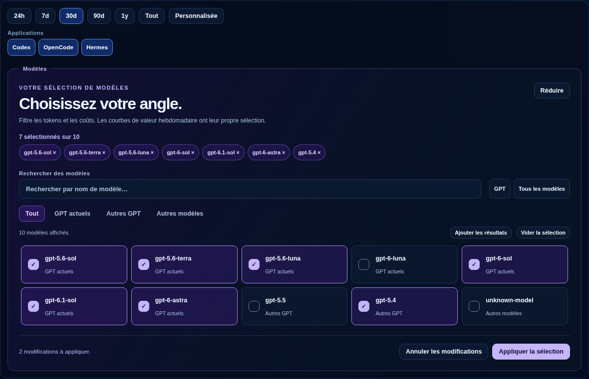
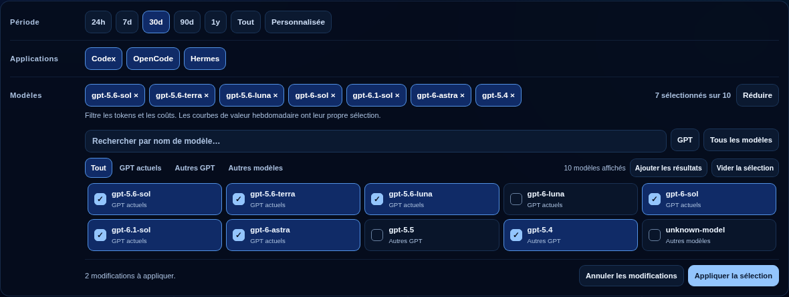

# Model selection prototype

This first sketch turns the Analytics model filter into a visual workspace.
Date range, application and model filters share aligned labels, button sizing
and blue selection states; custom dates stay beside the date-range controls.
The explorer starts collapsed, with the selection summary and selected chips
visible. Expanding it shows compact cards without internal scrolling: both the
catalog and selected chips grow naturally with their content. Apply/Cancel
controls appear only when changes are pending.

The previews use synthetic data from the browser-test fixture. The expanded
view shows one model removed and another added, with both changes still
awaiting application.

- Search model names and narrow the catalog to current GPT, other GPT, or other
  models. Current GPT means the existing `GPT_MODELS` quick-selection list.
- Keep selected models visible in removable chips even when search hides them.
- Use GPT or All models to replace the draft, or Add visible to extend it.
- Apply the whole selection in one request, or cancel back to the active filter.
  At least one model must remain selected before applying.
- Collapse the catalog or press Escape while retaining the draft and its
  Apply/Cancel controls. Reopening focuses the search field.

The model filter affects token usage and API-equivalent cost. Weekly-value
curve controls retain their independent selection. The draft survives data
refreshes and language changes within the page. Applied selections are saved
in this browser and included in locally shareable URLs; pending changes remain
scoped to the current page. Remembered models absent from the archive stay
visible and are labelled unavailable. All controls are available in English
and French.

Design choices still open for iteration include whether named or persistent
selections would be useful. No model capability, performance, or pricing claims
are added to cards.
